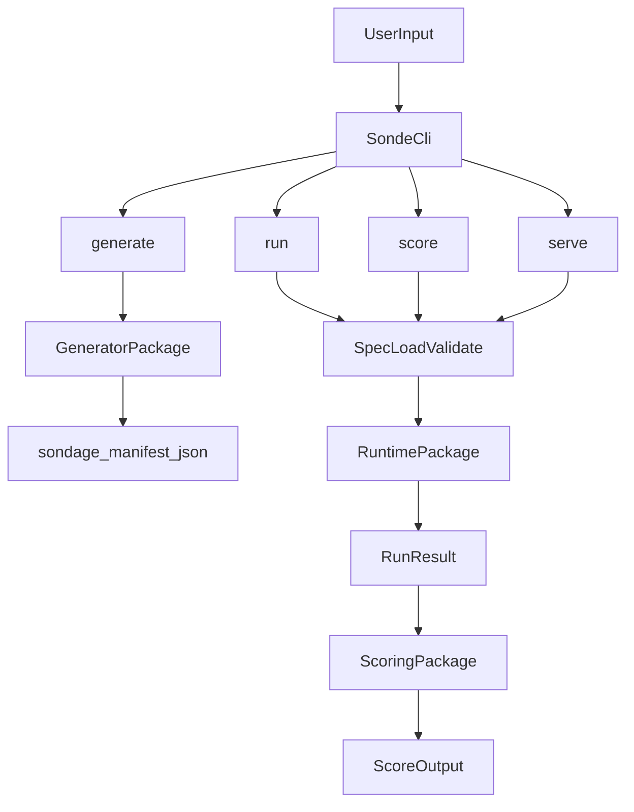

## Purpose

Describe how Sonde components interact so humans and LLM systems can reason about behavior accurately.

## Inputs

- CLI help text from a target binary.
- `sondage.manifest.json`.
- Optional JSON line requests for serve mode.

## Outputs

- Validated STM manifest.
- Deterministic run artifacts.
- Weighted scoring results.
- Tool list/call responses in serve mode.

## Package responsibilities

- `@sonde-sh/sonde`
  - Argument parsing, command dispatch, output formatting.
- `@sonde-sh/generator`
  - Help-text probing and manifest synthesis.
- `@sonde-sh/spec`
  - Schema/types plus manifest load/validation.
- `@sonde-sh/runtime`
  - Deterministic command execution and serve tool execution.
- `@sonde-sh/scoring`
  - Score computation from manifest and run results.

## Data flow

## Edge cases

- `run`/`score` validate CLI args but execute `manifest.cli.binary`.
- Preferred runtime flags are inferred from manifest options.
- Non-zero exits and interactive prompts reduce deterministic run quality.

## See also

- [CLI Reference](./cli-reference.mdx)
- [Manifest](./sondage-manifest.mdx)
- [Serve Protocol](./cli-serve-protocol.mdx)
